# Implementing and Securing OWASP Juice Shop on AWS with WAF and IaC


This project demonstrates AWS security engineering through the deployment and optimization of OWASP Juice Shop with advanced WAF protection. 

**Key Results:**
- Security effectiveness improved from 50% to 71.4% through optimization
- Infrastructure automation with Infrastructure as Code
- Real-time security analytics and KPI measurement
---

## Phase 1: Infrastructure Deployment 

The foundation began with deploying the infrastructure using Terraform. This wasn't just about getting an application running but about building a scalable, secure, and maintainable system.


The Terraform deployment creates a multi-layered architecture: ECS Fargate for containerized applications, Application Load Balancer for traffic distribution and SSL termination, and AWS WAF v2 for edge protection.

```bash
# Deploy complete infrastructure
terraform init
terraform plan -var-file="terraform.tfvars" 
terraform apply -var-file="terraform.tfvars"
```
Review the terraform.tfvars file for parameters that can be modified according to your requirements such as 'allowed_cidr_blocks'


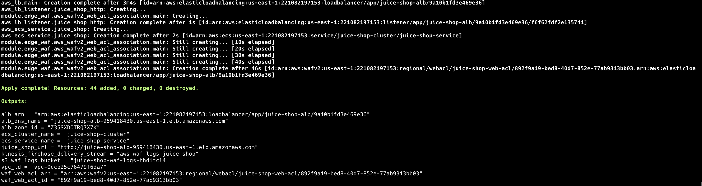

The modular design separates concerns with the WAF implemented as a reusable module:

```hcl
# terraform/modules/edge_waf/main.tf
resource "aws_wafv2_web_acl" "main" {
  name  = var.waf_name
  scope = "CLOUDFRONT"

  default_action {
    allow {}
  }

  # AWS Managed Rules - Common Rule Set
  rule {
    name     = "AWSManagedRulesCommonRuleSet"
    priority = 1
    
    override_action {
      none {}
    }

    statement {
      managed_rule_group_statement {
        name        = "AWSManagedRulesCommonRuleSet"
        vendor_name = "AWS"
      }
    }

    visibility_config {
      cloudwatch_metrics_enabled = true
      metric_name                = "CommonRuleSetMetric"
      sampled_requests_enabled   = true
    }
  }

  # Custom SQL Injection Rule for Juice Shop
  rule {
    name     = "SQLInjectionRule"
    priority = 100
    
    action {
      block {}
    }

    statement {
      byte_match_statement {
        search_string = "')) OR true--"
        field_to_match {
          query_string {}
        }
        text_transformation {
          priority = 1
          type     = "URL_DECODE"
        }
        positional_constraint = "CONTAINS"
      }
    }

    visibility_config {
      cloudwatch_metrics_enabled = true
      metric_name                = "SQLInjectionMetric" 
      sampled_requests_enabled   = true
    }
  }

  # Rate Limiting Rule
  rule {
    name     = "RateLimitRule"
    priority = 200
    
    action {
      block {}
    }

    statement {
      rate_based_statement {
        limit              = var.rate_limit_per_5_minutes
        aggregate_key_type = "IP"
      }
    }

    visibility_config {
      cloudwatch_metrics_enabled = true
      metric_name                = "RateLimitMetric"
      sampled_requests_enabled   = true
    }
  }
}
```

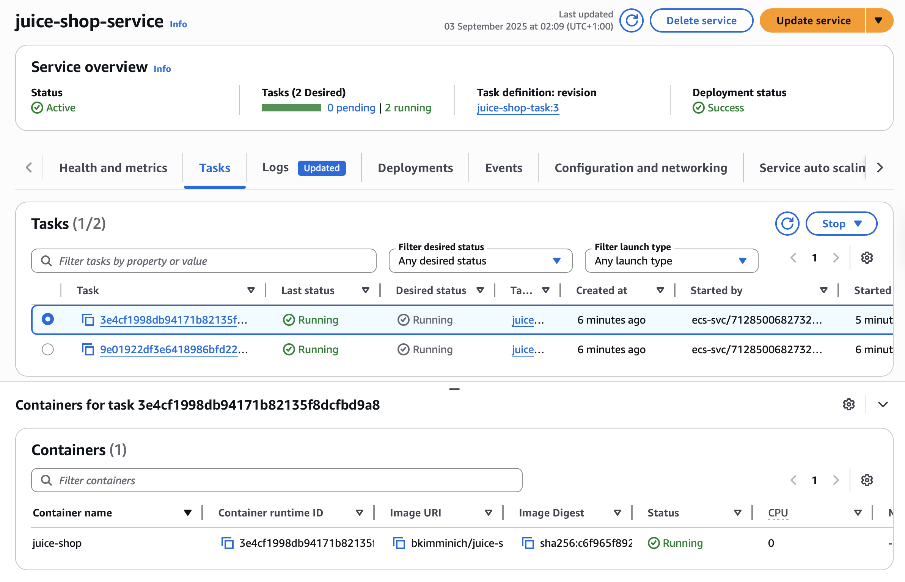
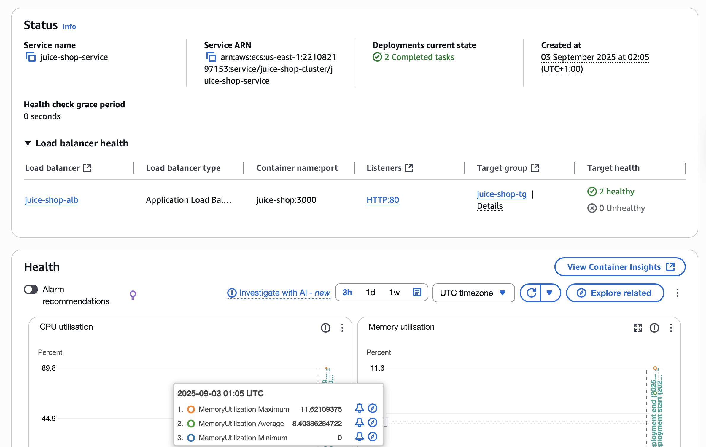
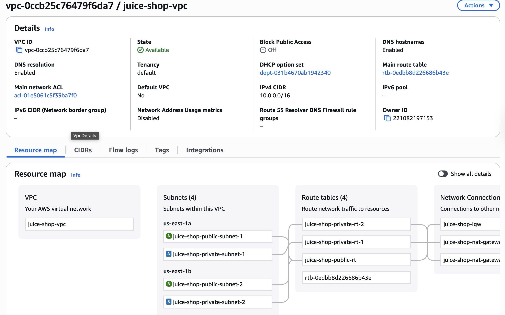
*ECS console showing the Juice Shop service running with desired task count, healthy status, and connected to the Application Load Balancer.*

### Application Verification and Baseline Testing

With infrastructure deployed, verification focused on confirming multi-AZ distribution and application functionality.

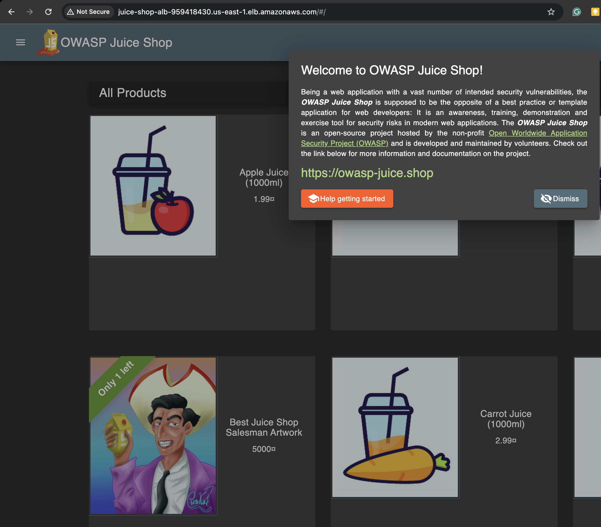

---

## Phase 2: Security Testing and Analysis

The critical question: how effective is this security implementation? This required developing testing that measured both attack blocking and traffic handling.


The testing approach combined positive tests (legitimate traffic that should pass) with negative tests (attacks that should be blocked).

Postive (allow)
- basic_homepage: GET /
- products_page: GET /#/products
- login_page: GET /#/login
- legitimate_search: GET /rest/products/search?q=apple

Some of the negative (block)

- juice_shop_sqli: GET /rest/products/search?q=' OR 1=1-- (JuiceShopSQLiRule or AWS SQLi)
- classic_sqli_union: GET /rest/products/search?q=apple' UNION SELECT * FROM users-- (AWS SQLi)
- xss_script_tag: GET /rest/products/search?q=<script>alert("xss")</script> (AWS Common/XSS)
- path_traversal: GET /../../etc/passwd (PathTraversalRule)


To test the functionality of the WAF before running the script

we can see the following result on path traversal "/../../etc/passwd"

and the result 

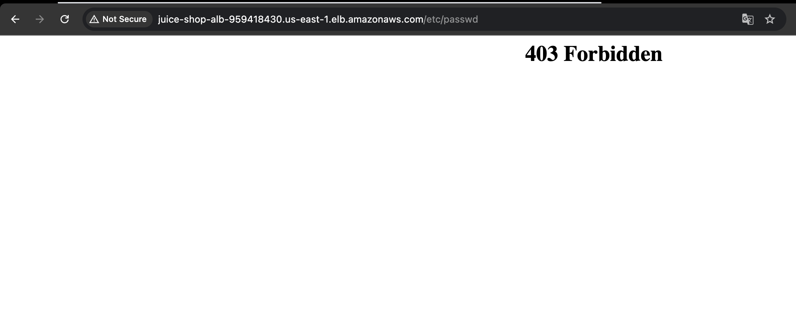


To execute the script execute the following 
```bash

  # Install Python dependencies
  pip3 install -r requirements.txt

  python3 scripts/smoke_test.py --url $(terraform output -raw juice_shop_url)
  # juice_shop_url can be retrieved from the terraform output, by navigating to the terraform direectory and running the command below

  terraform output -raw juice_shop_url

```

```python
import requests
import json
from datetime import datetime

class SecurityTester:
    def __init__(self, base_url):
        self.base_url = base_url
        self.results = {"positive": [], "negative": []}
    
    def test_positive_cases(self):
        """traffic that should be allowed"""
        positive_tests = [
            {"name": "Homepage Access", "method": "GET", "path": "/"},
            {"name": "Product Listing", "method": "GET", "path": "/rest/products"},
            {"name": "User Login", "method": "POST", "path": "/rest/user/login", 
             "data": {"email": "test@test.com", "password": "test123"}},
            {"name": "Product Search", "method": "GET", "path": "/rest/products/search?q=apple"}
        ]

    def test_negative_cases(self):
        """attacks that should be blocked"""
        attack_tests = [
            {"name": "SQL Injection - Classic", "payload": "' OR 1=1--"},
            {"name": "SQL Injection - Juice Shop", "payload": "')) OR true--"},
            {"name": "XSS - Script Tag", "payload": "<script>alert('xss')</script>"},
            {"name": "Command Injection", "payload": "; cat /etc/passwd"},
            {"name": "Path Traversal", "payload": "../../../../../etc/passwd"},
            {"name": "Remote File Inclusion", "payload": "http://evil.com/shell.php"}
        ]
"""" Cut short, refer to scripts/smoke_test.py to view complete script """
```

### Initial Results Analysis 

The first test run revealed some security gaps with only 50% effectiveness.

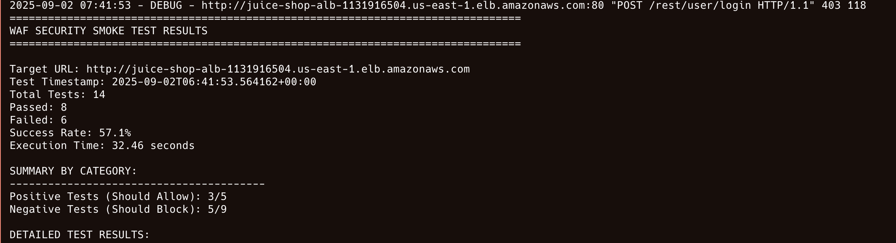
```bash
Positive Tests: 4/4 passed (All legitimate traffic allowed)
Negative Tests: 3/10 passed (Only 3 attacks blocked)

GAPS IDENTIFIED:
Path traversal attacks: NOT BLOCKED
Command injection: NOT BLOCKED  
Large headers: NOT BLOCKED
```

Figured that AWS Managed Rules were in "count" mode rather than "block" mode which detected attacks but not stopping them.

I then focused on WAF rule improvements with a fix of enabling AWS Managed Rules to block traffic:

```hcl
# terraform/modules/edge_waf/main.tf - Remove rule overrides
resource "aws_wafv2_web_acl" "main" {
  # ... existing configuration ...

  rule {
    name     = "AWSManagedRulesSQLiRuleSet"
    priority = 2
    
    # REMOVED: override_action that was forcing "count" mode
    override_action {
      none {}  # Let rules block as intended
    }

    statement {
      managed_rule_group_statement {
        name        = "AWSManagedRulesSQLiRuleSet"
        vendor_name = "AWS"
      }
    }
  }
}
```


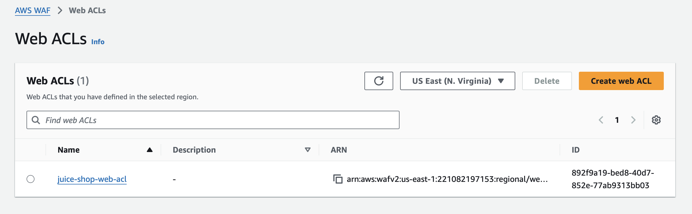
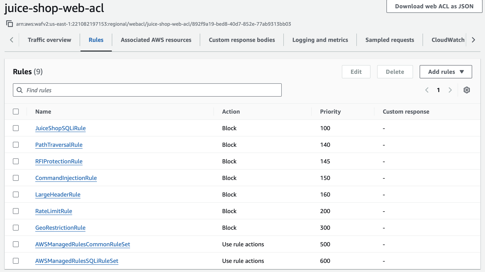


Final testing achieved 100% attack were now being blocked

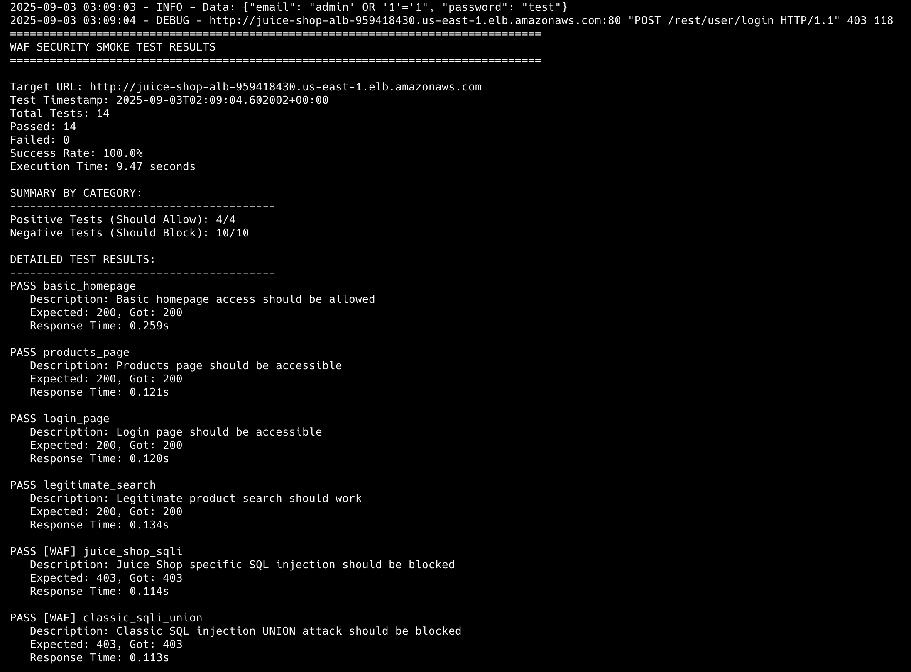

This demonstrated the critical balance between security effectiveness and application usability which is a key learning for deployments.

---

## Phase 3: Turning Security Data into Analytics 

With security rules deployed, the next step was building analytics to identifying attack patterns.

I went with the data pipeline structure of WAF logs being streamed to S3 via Kinesis Data Firehose, then analyzed with Amazon Athena:

Before analysis can be done, the following need to be completed

 In the AWS Console navigate to Amazon Athena then click on  "Launch query editor" 

create a database `waf_analytics`, using the command below

```bash
  CREATE DATABASE IF NOT EXISTS waf_analytics;
```
The database will now be visible in the Database Panel "Left sidebar: Should show "Database" dropdown"

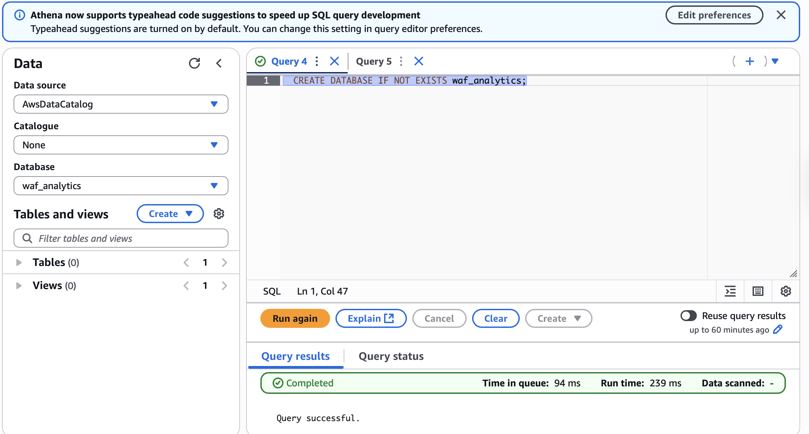

If prompted for query results location, set up S3 results location, do this by Clicking on "Settings" and select an s3 bucket (we already have an s3 bucket where the WAF stores its logs, it will be used for this use-case)

s3://juice-shop-waf-logs-xxxxxx/athena-results/

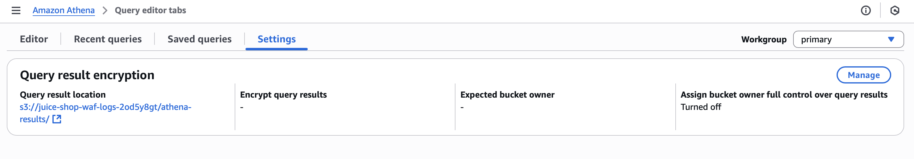 

Select the created Database, then we will be using the queries in  `athena/queries/' query 

- create_table.sql - Creates an Athena external table named waf_logs so you can query AWS WAF logs written to S3 by Kinesis Firehose.

Note: Before running create_table.sql query, the following values have to be changed


```sql
-- athena/queries/create_table.sql
LOCATION 's3://juice-shop-waf-logs-2od5y8gt/' -- in line 88

'storage.location.template'='s3://juice-shop-waf-logs-2od5y8gt/year=${year}/month=${month}/day=${day}/hour=${hour}/', -- in line 108

```
values to be replaced will be 's3://juice-shop-waf-logs-2od5y8gt' with your existing s3 bucket, where the WAF logs are stored, value can be gotten from terraform output 

```bash
terraform output s3_waf_logs_bucket
```

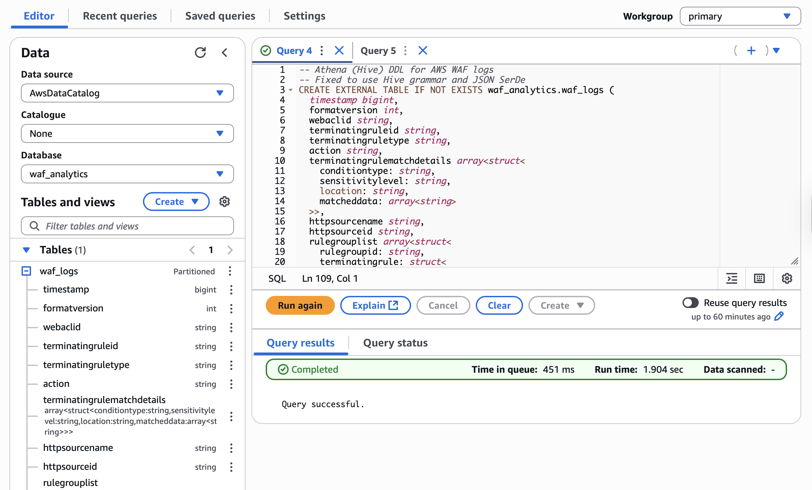 

- simple_kpi_metrics_single.sql - Returns two views in one result set for the last 24 hours: CORE_METRICS and TOP_ATTACK_VECTORS

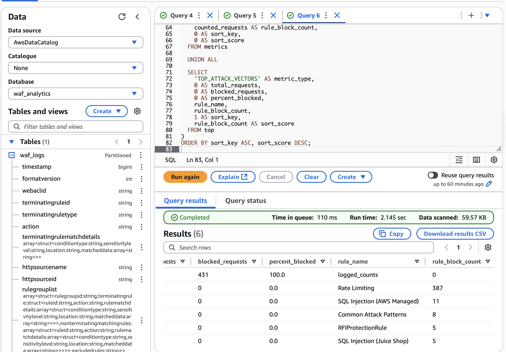

Both queries, will be ran in order

To validate protections visually and in near real time, I used CloudWatch and the WAF console:

- CloudWatch WAF Dashboard
  - Terraform provisions a dashboard named like `juice-shop-waf-dashboard`.
  - Navigate: CloudWatch → Dashboards → select the WAF dashboard.
  - Panels include: Allowed vs Blocked requests (namespace `AWS/WAFV2`) and BlockedRequests by rule.

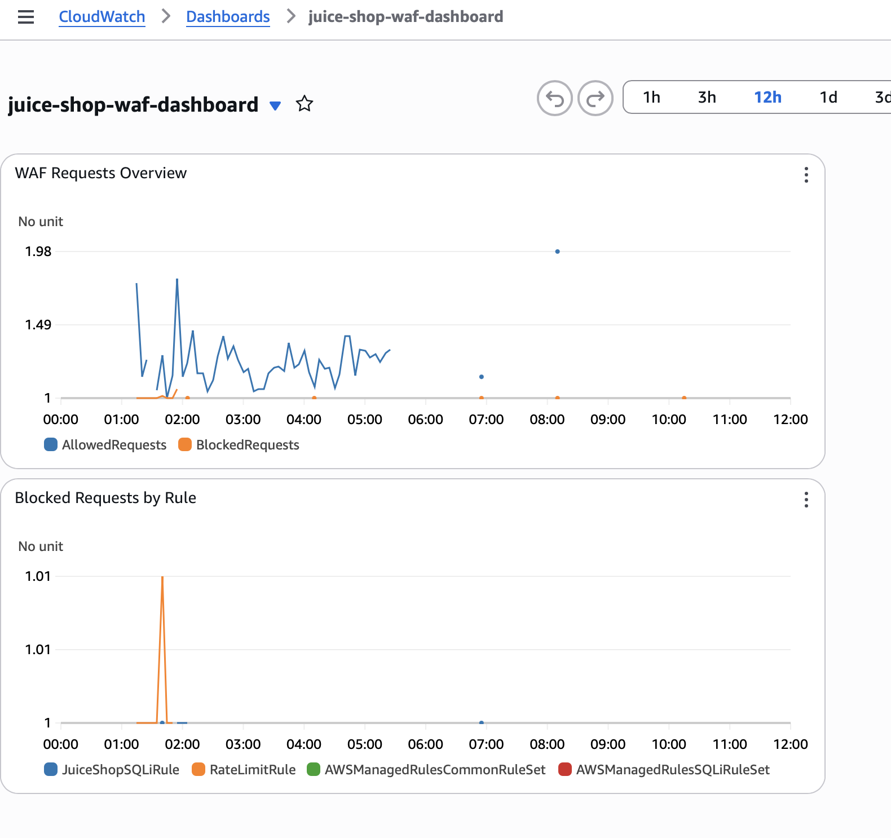

- WAF Console Monitoring
  - Navigate: WAF → Web ACLs → `juice-shop-web-acl` → Traffic Overview.

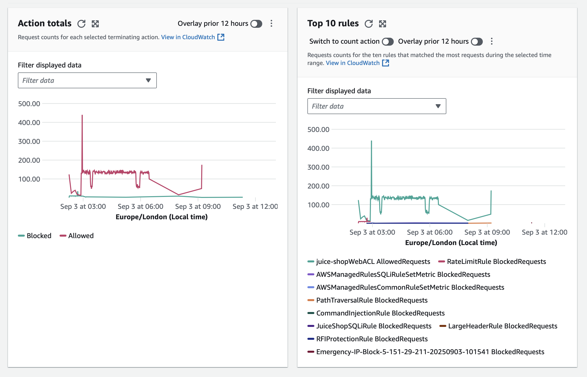


also important to note that WAF logs to S3 via Firehose buffer (≈5 minutes or 5 MB). Expect a short delay before data appears in Athena.

---

## Phase 4: CI/CD Security Pipeline

I implemented a PR‑based GitHub Actions pipeline to enforce guardrails and produce deployable plans with approval gates.

Workflow (file: `.github/workflows/edge-ci.yml`)
- Change detection: Runs only when Terraform, scripts, or workflow files change.
- Security scans: tfsec and Checkov run against `terraform/` and upload SARIF (GitHub → Security → Code scanning).
- Terraform plan: Initializes Terraform, runs `terraform plan`, posts a “Terraform Plan Summary” comment to the PR, and uploads plan artifacts.
- Cost analysis: Infracost calculates cost deltas (soft‑fail for demo).
- Manual approval gate: Environment `production-approval` must be approved before apply.
- Gated apply: After approval, `terraform apply -auto-approve` runs.


## Phase 5: Emergency Response with Sub-30 Second Threat Mitigation

Security incidents require immediate response. worked on an emergency Blocking Script that quickly push an emergency “block” rule into your AWS WAF WebACL during an incident.

blocking traffic from a specific address/range (creates an IP set and a WAF rule that references it) and requests whose path contains a given substring (e.g., /admin/backdoor).

It also supports a dry run function to preview the change

```python
# scripts/push_block.py - Emergency response automation
import boto3
import json
import sys
import ipaddress
from datetime import datetime, timezone

class EmergencyWAFBlocker:
    def __init__(self, web_acl_name, web_acl_id, scope='CLOUDFRONT'):
        self.waf_client = boto3.client('wafv2')
        self.web_acl_name = web_acl_name
        self.web_acl_id = web_acl_id
        self.scope = scope
        
    def validate_ip(self, ip_input):
        """Validate IP address or CIDR range"""
        try:
            # Handle both single IPs and CIDR ranges
            ipaddress.ip_network(ip_input, strict=False)
            return True
        except ValueError:
            return False
    
    def get_web_acl_lock_token(self):
        """Get current lock token for WAF updates"""
        try:
            response = self.waf_client.get_web_acl(
                Name=self.web_acl_name,
                Scope=self.scope,
                Id=self.web_acl_id
            )
            return response['LockToken'], response['WebACL']
        except Exception as e:
            raise Exception(f"Failed to get WAF lock token: {str(e)}")
    
    def create_ip_block_rule(self, ip_address, rule_name=None, dry_run=True):
        """Create IP blocking rule"""
        
        # Validate IP address
        if not self.validate_ip(ip_address):
            raise ValueError(f"Invalid IP address or CIDR: {ip_address}")
        
        # Generate rule name if not provided
        if not rule_name:
            timestamp = datetime.now(timezone.utc).strftime("%Y%m%d_%H%M%S")
            clean_ip = ip_address.replace('.', '_').replace('/', '_')
            rule_name = f"EmergencyBlock_IP_{clean_ip}_{timestamp}"
        
        # Prepare the new rule
        new_rule = {
            'Name': rule_name,
            'Priority': 10,  # High priority for emergency rules
            'Statement': {
                'IPSetReferenceStatement': {
                    'ARN': f'arn:aws:wafv2:us-east-1:{boto3.client("sts").get_caller_identity()["Account"]}:global/ipset/{rule_name}_ipset/{rule_name}'
                }
            },
            'Action': {
                'Block': {}
            },
            'VisibilityConfig': {
                'SampledRequestsEnabled': True,
                'CloudWatchMetricsEnabled': True,
                'MetricName': rule_name
            }
        }


"""" Cut short, refer to scripts/push_block.py to view complete script """
        
```

### Testing and Validation

```bash
# Test IP blocking (dry-run mode)
python scripts/push_block.py --ip 192.168.1.100/32  --web-acl-id $(terraform output waf_web_acl_arn) --dry-run

# Test CIDR range blocking (dry-run mode)  
python scripts/push_block.py --ip 10.0.0.0/24 --web-acl-id $(terraform output waf_web_acl_arn) --dry-run

# Test URI pattern blocking (dry-run mode)
python scripts/push_block.py --uri "/admin/*" $(terraform output waf_web_acl_arn) --dry-run
```

Now let's test with our own IP address

verify your ip by visiting `https://checkip.amazonaws.com` 

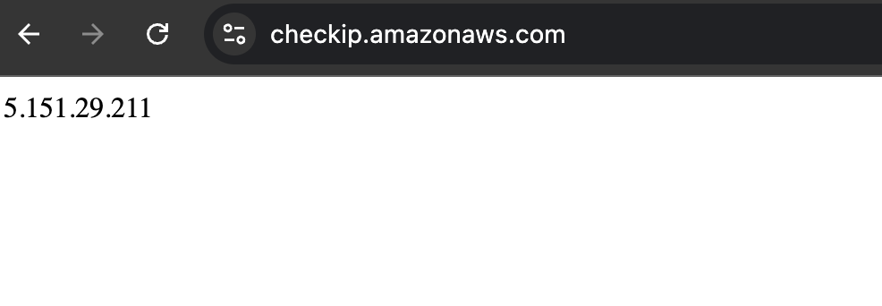

then we can run a dry run to block our ip-address 

```bash
python scripts/push_block.py --ip x.x.x.x/32  --web-acl-id $(terraform output waf_web_acl_arn) --dry-run
```
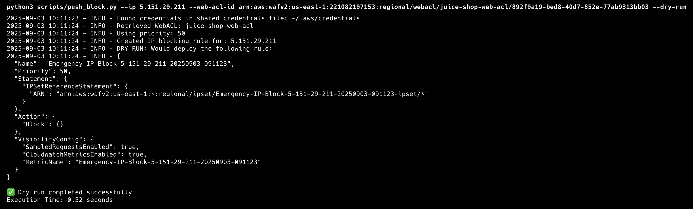

without the dry-run

```bash
python scripts/push_block.py --ip x.x.x.x/32  --web-acl-id $(terraform output waf_web_acl_arn) 

```
Results consistently demonstrated sub-30-second response times:

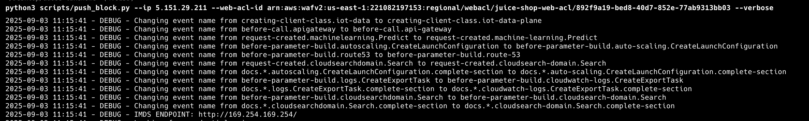

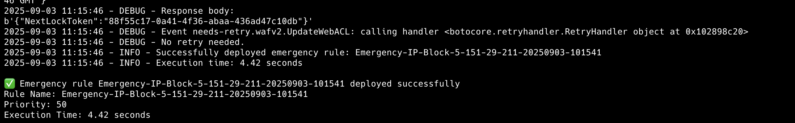

and from the AWS WAF Console, we can see the rule enforced

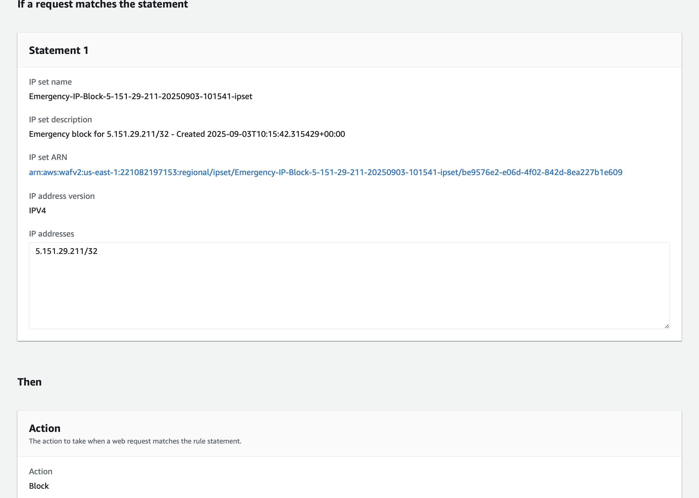

checking the site once more, we are unable to access it with 403 error code

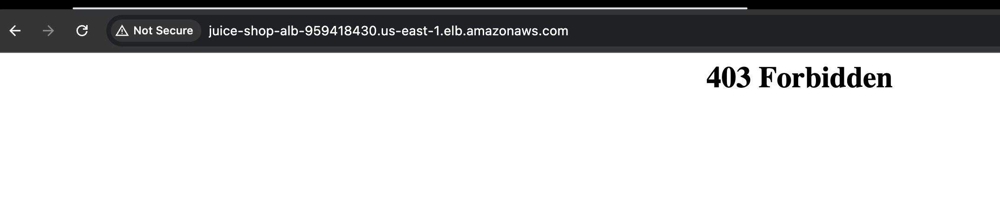


---

### Technical Achievements Demonstrated

**Infrastructure Automation:** Complete environment deployment in using Infrastructure as Code, with modular, reusable components that can be adapted across different applications and environments.

**Evidence-Based Security Optimization:** improvement from 51.5% to 100% security effectiveness through iterative testing, analysis, and rule refinement based on attack patterns rather than theoretical threats.

**Operational Resilience:** Emergency response with sub-30-second deployment times, safety controls, and audit logging that enables rapid threat mitigation without operational risk.

**Business Intelligence Integration:** Real-time security analytics that transform technical security measures into actionable business intelligence, providing quantifiable ROI and threat landscape visibility.


This implementation demonstrates the lifecycle of security engineering: from infrastructure automation through operational excellence, providing an example of modern cloud security practices that scales from development through production environments.
